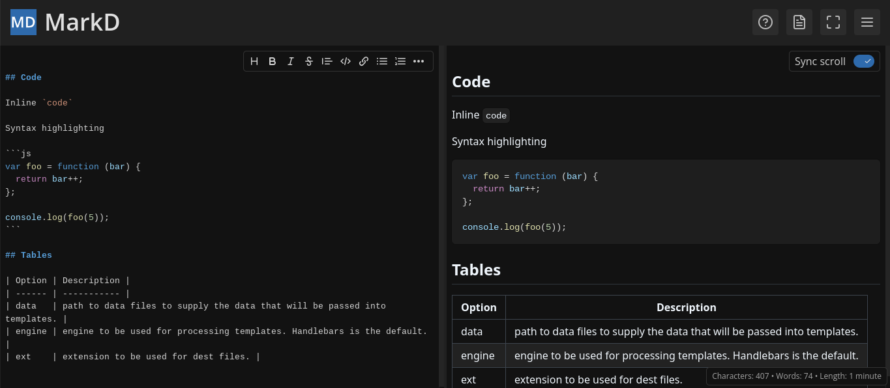
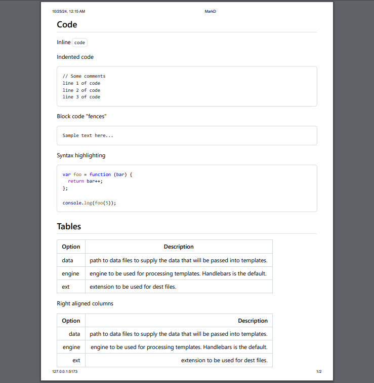

  <a href="https://markd.it" alt="Homepage" title="Homepage" style="display: flex; flex-direction: column; align-items: center; gap: 1em; text-decoration: none;">
    
    <h1 align="center">MarkD</h1>
  </a>

MarkD (sounds like "maarkt" when pronounced) is an advanced live markdown editor in your browser. It
is designed to be a sleek, fast and opinionated markdown editor that can be used to write and
preview markdown files in real-time for school, work or research. It is built using Svelte and
Carta, all components are hand made using tailwind and svelte.

  Sleek, fast and opinionated open-source markdown editor.

## Features

- PDF, RTF, MD and HTML export
- Word count and reading time
- Professional print layout
- Code syntax highlighting
- Live preview of markdown
- Refined homemade editor
- Advanced IntelliSense
- Custom editor themes
- Supports inline HTML
- Scalable Split view
- No ads or tracking
- Persistent storage
- Printer friendly
- Emoji insertion
- Extended syntax
- Sleek dark UI
- LaTeX support
- Scroll sync
- Zen mode

 

### Contact Us

- [GitHub Issues](https://github.com/itzCozi/markd/issues)
- [Developers Email](mailto:dev@wyzie.ru)

---

  Created by <a href="https://github.com/itzcozi" title="BadDeveloper's github">BadDeveloper</a> and <a href="https://github.com/Pasithea0" title="Pas's github">Pasithea</a> with 💙

